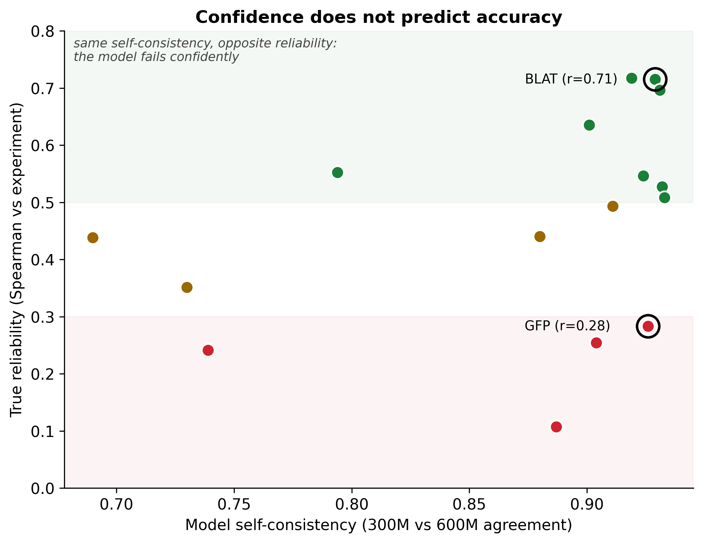
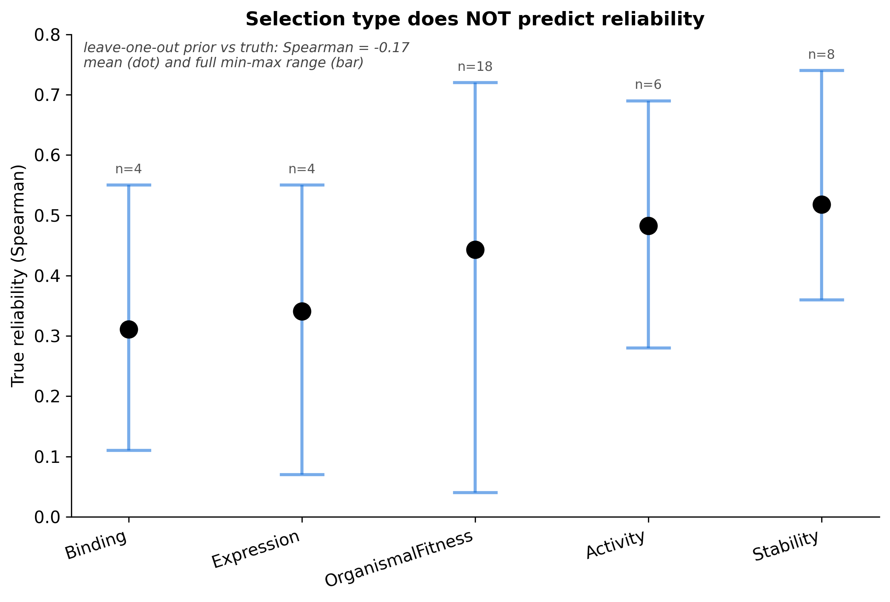
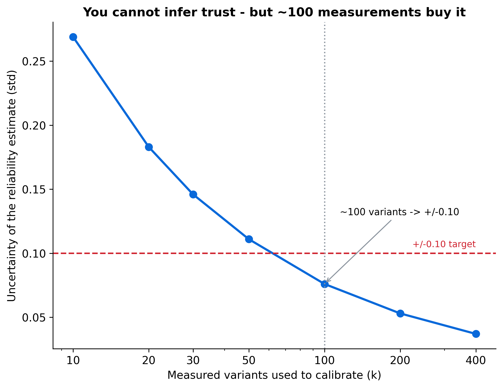
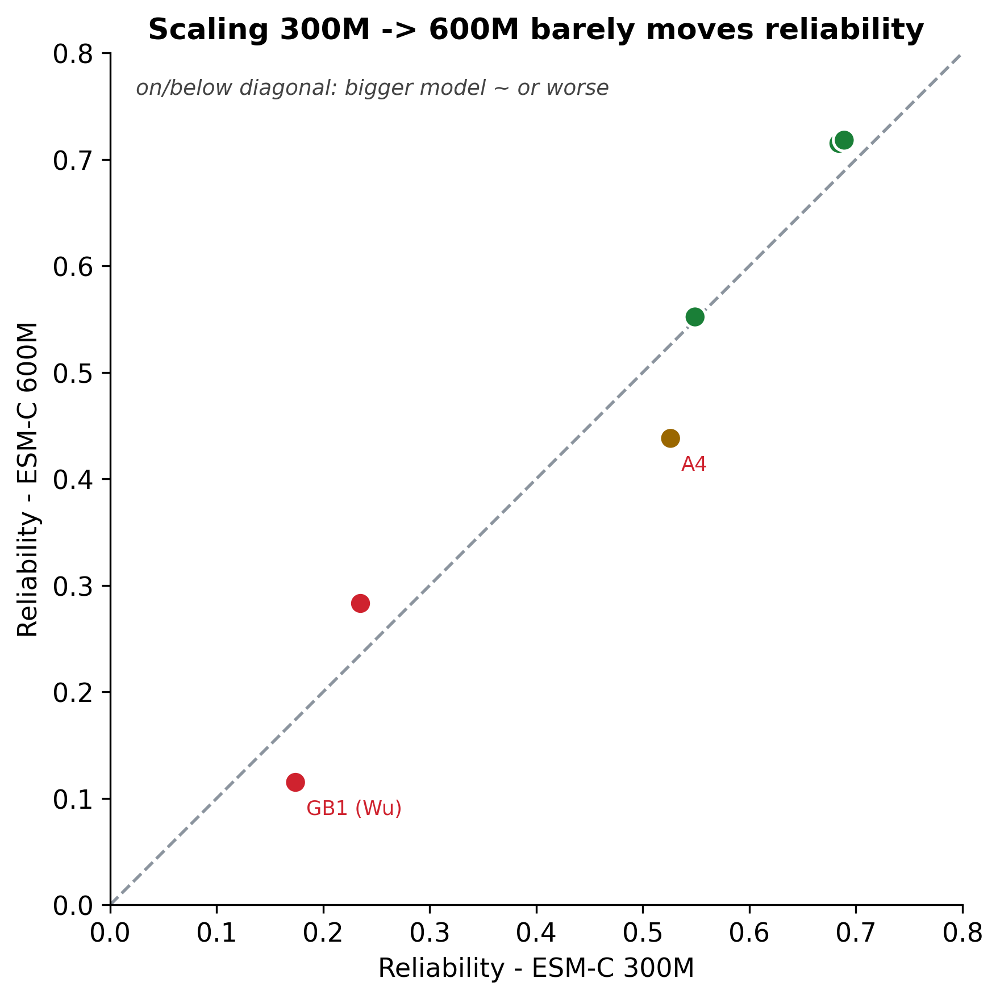

# esm-trust

**A reliability layer for ESM-C zero-shot variant-effect predictions.** It answers the one question the model itself can't: *should you trust its predictions for your protein?*



## Why this exists

Protein language models like ESM-C predict which mutations help or harm a protein. They are genuinely strong where the assayed phenotype is shaped by the same evolutionary pressure that shaped the protein, and unreliable where it is not (fluorescence brightness, specific-partner binding, aggregation, rapidly-evolving viral proteins).

The danger is that **this competence boundary is invisible from the inside.** Stress-testing ESM-C on ProteinGym, we found:

- It nails conservation-coupled assays (BLAT 0.72, PABP 0.72) and fails others (GFP brightness 0.28, GB1 binding 0.11).
- **The failures are confident and consistent.** The 300M and 600M models agree just as strongly on the proteins it gets wrong (GFP) as on the ones it gets right (BLAT). Self-consistency does not predict accuracy.
- No shortcut predicts where it fails: not internal agreement (rho 0.46), not phenotype labels (0.04), not ProteinGym's own selection-type metadata (-0.17).
- Scaling 300M to 600M barely moves reliability, and is negative on some assays.

The only honest way to know if ESM-C works for your assay is to **measure it** against a handful of known variants. About 100 measurements pin reliability to +/-0.10.

| | |
|---|---|
|  |  |



## Install

```bash
pip install -e ".[model]"   # the [model] extra adds torch + esm for the real scorer
```

## Use

```python
from esm_trust import report

WT = "MKT...your wild-type sequence..."
variants = ["A12V", "G34S", "L56P:K78E"]        # standard mutation strings

# With a measured calibration set (recommended):
measured = {"A12V": 1.3, "G34S": -2.1}          # your lab values
report(WT, variants, measured=measured)
#  -> bootstrapped reliability (rho_hat +/- 95% CI), a verdict
#     (RELIABLE / MARGINAL / UNRELIABLE), and how many more variants to measure.

# With no measurements, it gives only a one-sided guardrail and refuses to vouch:
report(WT, variants)
```

`recommend_n(rho_hat, target_se)` returns how many variants to measure for a target precision.

## Honest limitations

- Scores are additive across sites, so for libraries with many multi-site variants the ranking partly tracks mutation count, not just per-mutation quality (flagged automatically).
- Validated on 16-40 ProteinGym assays with the ESM-C family; viral and membrane proteins are underrepresented.
- Calibration requires labeled variants. That cost is the point, not a bug.
- Zero-shot only; fine-tuning is out of scope.

## License

MIT.
