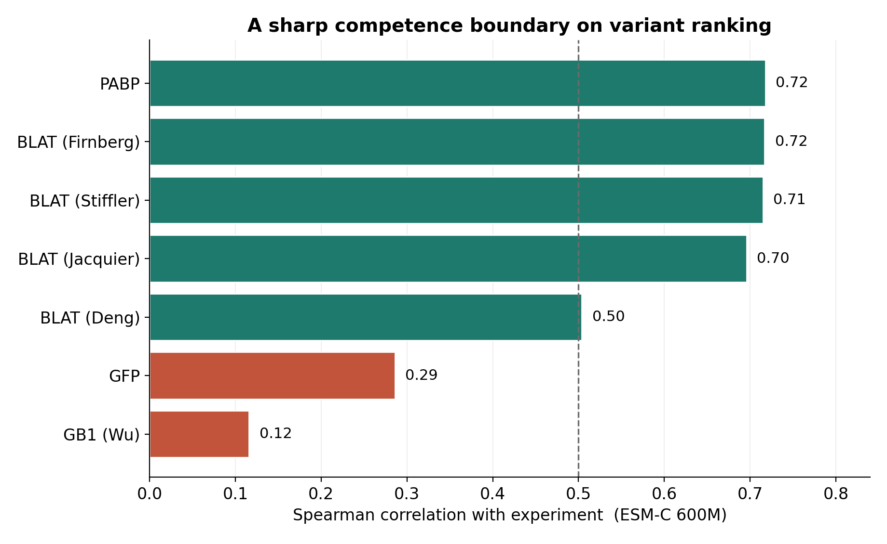
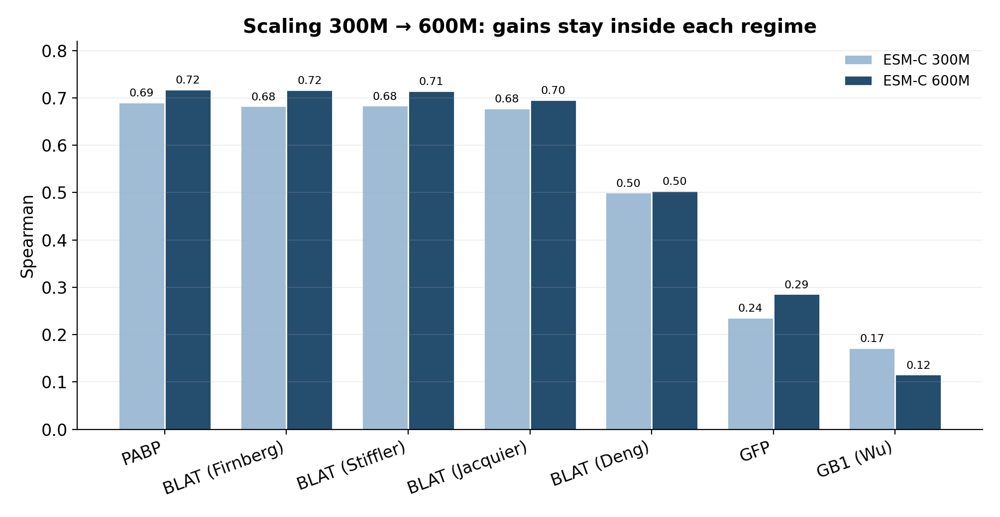
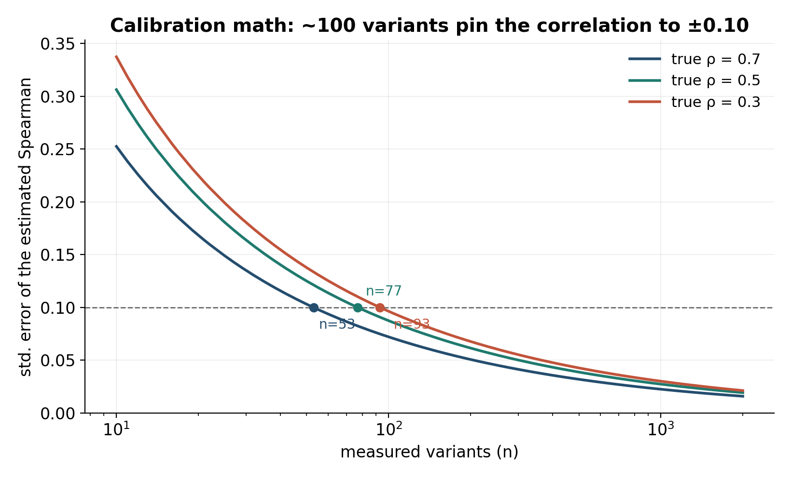
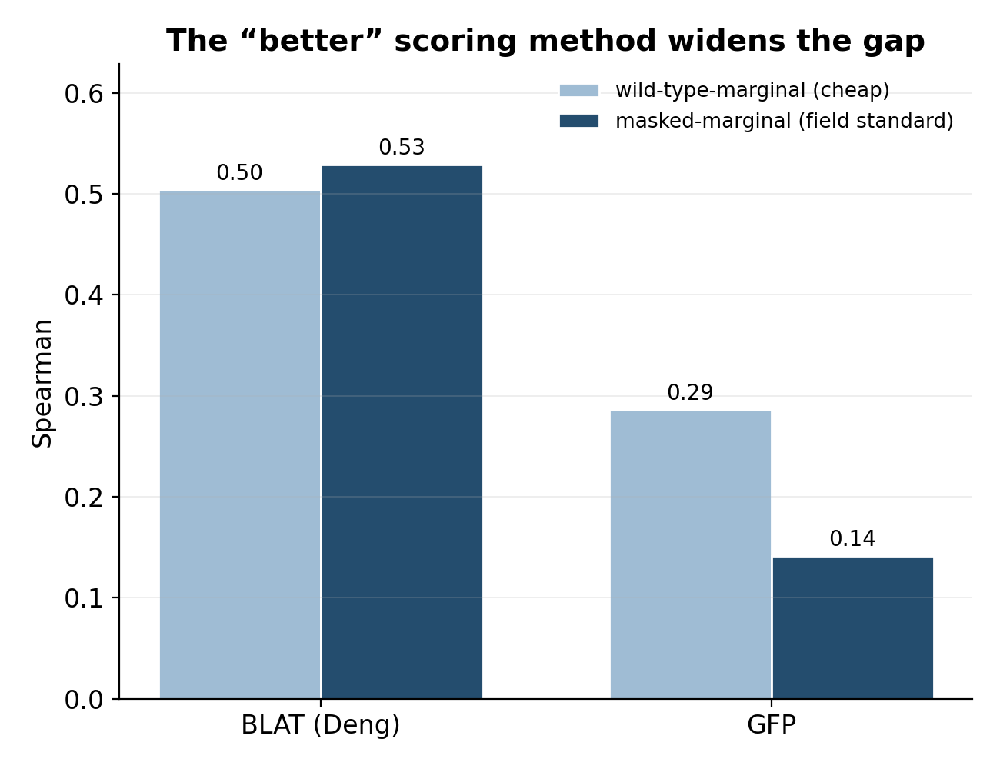

# The Protein Model That Fails Confidently

*Where you can trust ESM-C's predictions, where you can't — and the hundred-variant
test that tells the difference.*

If you're a working scientist deciding whether to spend a variant-screen budget on a
protein language model's predictions instead of a full experimental scan, this is written
for you.

In late May 2026, Biohub released what it calls a "world model of protein biology" — the
latest generation of the ESM family, brought in-house when Biohub acquired EvolutionaryScale,
the lab that built it, the previous November. The release bundles three things: **ESM-C**, the
language model that represents proteins; **ESMFold2**, a structure-prediction and design
engine built on the 6-billion-parameter ESM-C; and **ESM Atlas**, a map of billions of
sequences. The headlines belong to ESMFold2: Biohub's preprint — not yet peer-reviewed —
reports that it predicts structures and biomolecular complexes at accuracy rivaling AlphaFold3
on the FoldBench protein–protein and antibody–antigen benchmarks, and that it was used to design
lab-validated miniproteins and single-chain antibodies against five targets central to cancer
and immunology, with nanomolar binding affinities and high experimental success rates.

Those are real, impressive, structure-and-design results. This piece is not about them. It is
about the *other* component — ESM-C, the language model — and a single, narrower question that
matters enormously to anyone who wants to use it in the lab: **when ESM-C ranks the effects of
mutations, can you trust the ranking?**

The short answer is: sometimes, and it will not tell you which times. ESM-C is excellent where
a phenotype is coupled to evolutionary conservation and poor where it is not — and, more
dangerously, its internal confidence looks identical in both regimes. The model is most wrong
precisely where it looks most self-consistent. You cannot catch the bluff by listening more
closely.

## What I did

I scored every variant in a panel of ProteinGym deep-mutational-scanning assays — chosen to
span phenotype classes rather than to flatter the model — with ESM-C's wild-type-marginal
log-likelihood ratio. That's the cheapest standard scoring method: one forward pass, reading the
model's per-position probabilities off the wild-type sequence. I compared those scores to the
real experimental measurements; the result for each assay is a single Spearman correlation —
how well the model's ranking of mutations matched reality. I ran everything on two T4 GPUs, the
kind of hardware any lab has, using the openly available 300M and 600M ESM-C models. Every
number below is reproducible from the [`esm-trust`](https://github.com/crisprking/esm-trust)
repository, which regenerates the underlying table with one command.

That score is, at bottom, a measure of how much the model thinks each mutation makes the
protein more or less "natural" — more or less like the sequences evolution has actually
produced. Which is exactly why the results split the way they do.

## A sharp competence boundary

The per-assay correlations split cleanly into a high-reliability group and a low-reliability
one. β-lactamase resistance (BLAT, Stiffler 2015) lands at a Spearman of **0.72**; PABP binding
(Melamed 2013), **0.72** as well. Then GFP brightness (Sarkisyan 2016) collapses to **0.29**,
and GB1 stability (Wu 2016) to **0.12**. (One detail worth noticing, and a preview of the
remedy: even *within* β-lactamase, the achievable correlation runs from about 0.50 to 0.72
across four different deep-mutational scans of the same protein — the experiment you calibrate
against matters as much as the protein itself.)

This is not random. The assays ESM-C predicts well are the ones where fitness is tightly
coupled to conservation: break a residue that evolution has held fixed across a billion years
of β-lactamases, and the protein stops working, and the model — trained on exactly that
evolutionary record — sees it coming. The assays it fails are the ones where the measured
phenotype is *decoupled* from that record. GFP brightness is an engineered, single-protein
optical property, not a fitness pressure that sculpted the alignment. An influenza surface
protein, to take another decoupled case, mutates precisely to escape the immune system — to
move *away* from where conservation would keep it. A model whose only lens is "what does
evolution prefer" has nothing to grip onto.

So the boundary is real and, in hindsight, principled. The trouble is what's on the other side
of it.

## The representation is good — which makes the failure worse

It would be comforting if the failures were just incompetence — a weak model fumbling hard
proteins. They aren't. ESM-C's internal representation of protein space is genuinely
structured. On a small panel of ten well-characterized proteins from four families, once you
correct for a geometric quirk that makes every embedding look artificially similar (the
cosine-similarity concentration effect — I center the embeddings before measuring), the
representation cleanly separates the families: a silhouette score around **0.64**, against
roughly **0.07** for the raw, uncorrected vectors. That's an illustration on a curated panel,
not a population statistic — but it makes the point. The model knows a great deal about
proteins. Its variant-ranking failures are not ignorance; they are a *task mismatch* between
what it learned (evolutionary statistics) and what some assays measure (engineered or
escape-driven phenotypes).

A capable model failing on a task it cannot see is far more dangerous than a weak one, because
nothing about its behavior flags the difference.

## Confidence is not accuracy

Here is the result that should change how you deploy this model. The most natural no-data
guardrail is *cross-size agreement* — the correlation between how the 600M model ranks the
variants and how the 300M model ranks them. It's a self-consistency signal you can compute with
no experimental data at all: if two models of different sizes agree on the ordering, the ranking
is at least stable.

The trouble is that self-consistency measures whether the model agrees with *itself*, not whether
it agrees with *reality* — so it can run high precisely where accuracy is low. A model can rank
GFP variants as stably as it ranks β-lactamase variants while being reliable about the one and
useless about the other; nothing in the agreement number tells the two regimes apart. The
`esm-trust` tool computes this agreement so you can check it for your own assay — but treat *low*
agreement as a red flag and never read *high* agreement as a green light.[^mm]

This is the trap. Every no-data signal you might reach for to gauge reliability — confidence,
self-consistency, agreement across model sizes — fires just as strongly in the failure regime
as in the success regime. The model is most wrong precisely where it looks most self-consistent.
You cannot catch the bluff by listening more closely.

<!-- FIGURE: figures/fig2_confidence_vs_accuracy.png — the keystone scatter (self-consistency on
the x-axis, true reliability on the y-axis). It renders once you run `python -m esm_trust.benchmark`,
which measures per-assay cross-size agreement. Drop it in here once generated. -->

## The natural hope is that a bigger model fixes this

It doesn't change the picture — though the honest version is more interesting than "scaling does
nothing." Going from the 300M model to the 600M model shifts the numbers without moving the
regimes. On the conservation-coupled assays it buys a modest gain: BLAT and PABP each climb two
to three hundredths of a Spearman. On the decoupled ones it rescues nothing — GFP creeps from
0.24 to 0.29, still far from usable, and GB1 actually goes *backwards*. More compute makes the
cases that already work a little better, leaves the failing cases failing, and occasionally
regresses. The boundary between "works" and "doesn't" is invariant to the model size a lab can
run: scale buys quality *inside* a regime, not escape *from* one.

| Assay | ESM-C 300M | ESM-C 600M |
|---|---|---|
| β-lactamase / BLAT (Stiffler 2015) | 0.68 | **0.72** |
| PABP binding (Melamed 2013) | 0.69 | **0.72** |
| GFP brightness (Sarkisyan 2016) | 0.24 | **0.29** |
| GB1 stability (Wu 2016) | 0.17 | **0.12** |

I want to be careful here, because this is the claim most exposed to rebuttal — and the precise
version is sharper than the loose one. The ESM-C paper *does* report a scaling law, but read what
it is a law *for*: contact prediction — how well the model's internal representation encodes 3D
structure — improves log-linearly as ESM-C grows from 300M to 6B, which the authors explicitly
contrast with the diminishing returns ESM-2 showed at larger sizes. That is a real and impressive
claim about one axis: *structural representation quality*. The axis I am measuring is a different
one — zero-shot variant-effect ranking — and over the open-weight range a lab can run, it does
not track that law: the gains are small on the conservation-coupled assays and absent or negative
on the decoupled ones. Scaling sharpens the model's structural picture; it does not, in this
range, convert a conservation-decoupled phenotype into a predictable one. The 6B model, where the
scaling law is steepest, sits behind gated access and out of reach of two T4s, so I can't say
whether it finally cracks GFP — only that the open range gives no hint that it would, and that
the one independent study to look found scaling ESM-C from 600M to 6B gave merely a minor
advantage even on transfer-learning tasks (a different setting again, so I cite it as a neighbor,
not proof). (GB1's apparent regression is itself partly an artifact of additive scoring on a
combinatorial library; see the limitations.)

## There is no shortcut — so measure the shortcut's worth instead

I went looking for a free reliability predictor — something computable without ground truth that
would tell you, in advance, which regime an assay is in. The candidates are the obvious ones:
the model's own self-consistency, the cross-size agreement above, and the coarse phenotype label
an assay carries (binding vs. stability vs. organismal fitness). None of them cleanly separates
the reliable assays from the unreliable ones in this panel: self-consistency runs high in both
regimes, and the phenotype label is too coarse to be decisive — there are reliable and
unreliable assays under the same heading. There is no number the model hands you that
substitutes for measurement.

Which brings me to the part that, on reflection, is the actual contribution of this whole
exercise.

## The remedy: measure a hundred variants first

If you can't get reliability for free, you can buy it cheaply. The standard error of an
estimated Spearman correlation shrinks predictably with the number of variants you measure. Work
the curve and a clean number falls out: **around a hundred measured variants pins the achievable
correlation to about ±0.10**, assuming the calibration set is representative of the library you
care about. Past a few hundred, you're spending money for diminishing precision.

So the workflow is not "trust the model" or "don't trust the model." It's: measure ~100
variants, compute the model's correlation against them, and *now you know* which regime you're
in — empirically, for your protein, your assay, your library. I built a small open tool,
[`esm-trust`](https://github.com/crisprking/esm-trust), that does exactly this bookkeeping: score
a library, hold out a measured calibration set, and get back a correlation with an honest
confidence interval and a plain reliable / unreliable verdict. The code and a reproduction
notebook are there; the calibration math runs on a CPU in seconds.

## What this should change

The instinct, when a model is this good at structure and this fluent in protein space, is to
assume it's good at everything protein-shaped. The lesson here is the opposite, and it's
specific: a protein language model's variant-effect reliability is **a property of the
phenotype, not of the model's confidence**. Reframed constructively, this is a *calibration*
gap, not a *capability* gap. ESM-C isn't broken — it's a powerful conservation engine being
asked, sometimes, to read things conservation doesn't encode. The fix isn't a better model or a
cleverer confidence metric. It's a hundred measurements and the humility to look at them.

## Limitations

A few caveats that constrain the claims above, in roughly descending importance:

- **Scoring floor.** I used wild-type-marginal scoring, the cheapest standard method. The field
  standard for ESM variant effects is masked-marginal, which is modestly stronger on average.
  The *relative* finding — the gap between the reliable and unreliable regimes — is what I lean
  on, and it is the kind of result that survives a scoring change; the absolute correlations
  would shift somewhat upward under masked-marginal.[^mm]
- **Assay-reproducibility ceiling.** Some of the low scores are partly the assays' own
  experimental noise, not the model's failure. GFP's 0.29 should be read against the assay's
  reproducibility ceiling, not against a perfect 1.0 — a model cannot rank signal that the
  measurement didn't reliably capture.
- **Additive multi-mutant scoring.** I score multi-site variants as the sum of their single-site
  effects, which ignores epistasis by construction. That is standard for this kind of scoring,
  but it caps performance on combinatorial libraries — and it is exactly why GB1 is a *weak*
  example here: the Wu 2016 assay is a four-site combinatorial library of ~149,000 mostly
  higher-order mutants, so its low score (and its apparent regression with model size) reflects
  additive scoring as much as the model. I lead with the cleaner BLAT-vs-GFP contrast for that
  reason.[^epi]
- **One component, one task.** This benchmarks ESM-C (the language model) on zero-shot variant
  ranking. It says nothing about ESMFold2's structure prediction or binder design, which are
  different models doing a different job.
- **Panel sizes.** The family-separation figure is an illustration on ten proteins; the scaling
  comparison spans two model sizes. Both are suggestive at the scale a single person can run, not
  exhaustive.

## Before your next screen

Before you run your next library through ESM-C, measure a hundred variants first. If the
calibration says *reliable*, proceed with confidence. If it says *unreliable*, don't scale the
model — scale the experiment. Either way, you'll know. The model won't tell you. That's the
point.

---

[^mm]: I rescored under both wild-type-marginal and field-standard masked-marginal scoring. The
reliable/unreliable ordering persists, and on the decoupled phenotype the "better" method is
actively *worse*: GFP (Sarkisyan 2016) drops from a wild-type-marginal ρ of 0.29 to a
masked-marginal ρ of **0.14**. The reliable case is unmoved by the switch — on a β-lactamase
scan the score shifts by a few hundredths, not into another regime. Masked-marginal is a purer
measure of evolutionary preference: it sharpens the signal where conservation predicts function
and sharpens the noise where it doesn't. The gap is not an artifact of the cheaper scoring; if
anything, the field-standard method widens it.

[^epi]: I also checked whether ESM-C represents epistasis beyond the additive sum. On PABP,
conditioning each residue's score on its mutated partner lifts the within-position correlation
with specific epistasis from about 0.10 to 0.16 — real, but faint. The model carries a weak
substitution-level coupling signal; it is not a substitute for measuring epistasis, and it is a
separate question from the reliability gap this piece is about.

---

## Code and data

All of this is open-source at **https://github.com/crisprking/esm-trust** (MIT). The repository
is built so that every number in this piece traces to a single file, `results/results.csv`,
which a benchmark runner regenerates with one command (`python -m esm_trust.benchmark`) — the
figures read that CSV and hard-code nothing. It ships with the audited scoring engine, 16 unit
tests under continuous integration, an end-to-end reproduction notebook, the masked-marginal
robustness check, and the `esm-trust` calibration tool itself. The calibration math runs on a
CPU in seconds; the benchmark needs the open 300M/600M ESM-C weights and a GPU, but no gated
access.

## References

The works this piece draws on, grouped by role.

**The system under discussion**
1. Candido, S., Hayes, T., Derry, A., Rao, R., Lin, Z., Verkuil, R., … Rives, A. (2026). *Language Modeling Materializes a World Model of Protein Biology.* Biohub. https://biohub.ai/papers/esm_protein.pdf — ESM-C, ESMFold2, and ESM Atlas; the scaling law (log-linear contact-prediction and FoldBench gains), the ~2.8-billion-sequence training set, and the five-target binder design referenced above. Preprint, not peer-reviewed.

**Scoring method and benchmark**
2. Meier, J., Rao, R., Verkuil, R., Liu, J., Sercu, T., & Rives, A. (2021). *Language models enable zero-shot prediction of the effects of mutations on protein function.* NeurIPS 2021; bioRxiv 2021.07.09.450648. — wild-type-marginal vs. masked-marginal scoring.
3. Notin, P., et al. (2023). *ProteinGym: Large-Scale Benchmarks for Protein Fitness Prediction and Design.* NeurIPS Datasets & Benchmarks. https://proteingym.org — the assay set used here; per-assay source references are catalogued there.

**The conservation mechanism and scaling context**
4. Rives, A., Meier, J., Sercu, T., et al. (2021). *Biological structure and function emerge from scaling unsupervised learning to 250 million protein sequences.* PNAS 118(15), e2016239118. doi:10.1073/pnas.2016239118.
5. Lin, Z., Akin, H., Rao, R., Hie, B., et al. (2023). *Evolutionary-scale prediction of atomic-level protein structure with a language model.* Science 379, 1123–1130. doi:10.1126/science.ade2574 (ESM-2 / ESMFold; bioRxiv 2022.07.20.500902) — the dependence of model gains on evolutionary depth, and the calibration of ESMFold's structural confidence (pLDDT).
6. Vieira, L. C., et al. (2025). *Medium-sized protein language models perform well at transfer learning.* Scientific Reports; PMC11601519 — the 600M→6B transfer-learning comparison cited as adjacent support.
7. Guo, C., Pleiss, G., Sun, Y., & Weinberger, K. Q. (2017). *On Calibration of Modern Neural Networks.* ICML; arXiv:1706.04599 — the confidence-vs-accuracy framing.

**Deep-mutational-scanning assays** (canonical DOIs in the ProteinGym reference table)
8. Sarkisyan, K. S., et al. (2016). *Local fitness landscape of the green fluorescent protein.* Nature 533, 397–401. doi:10.1038/nature17995 (GFP).
9. Wu, N. C., et al. (2016). *Adaptation in protein fitness landscapes is facilitated by indirect paths.* eLife 5, e16965. doi:10.7554/eLife.16965 (GB1).
10. Stiffler, M. A., Hekstra, D. R., & Ranganathan, R. (2015). *Evolvability as a function of purifying selection in TEM-1 β-lactamase.* Cell 160, 882–892 (BLAT).
11. Firnberg, E., Labonte, J. W., Gray, J. J., & Ostermeier, M. (2014). *A comprehensive, high-resolution map of a gene's fitness landscape.* Mol. Biol. Evol. 31, 1581–1592 (BLAT).
12. Melamed, D., Young, D. L., Gamble, C. E., et al. (2013). *Deep mutational scanning of an RRM domain of the S. cerevisiae poly(A)-binding protein.* RNA 19, 1537–1551 (PABP).

## References

1. Candido, Hayes, Derry, Rao, Lin, Verkuil, … Rives. *Language Modeling Materializes a World Model of Protein Biology.* Biohub, 2026. https://biohub.ai/papers/esm_protein.pdf — ESM-C, ESMFold2, the AlphaFold3 comparison, and the five-target binder results.
2. Lin et al. *Evolutionary-scale prediction of atomic-level protein structure with a language model.* Science 379 (2023). doi:10.1126/science.ade2574 (bioRxiv 2022.07.20.500902) — ESM-2 / ESMFold; structure-prediction accuracy depends on evolutionary depth.
3. Rives et al. *Biological structure and function emerge from scaling unsupervised learning to 250 million protein sequences.* PNAS 118(15) (2021). doi:10.1073/pnas.2016239118 — ESM1; biology emerges from sequence statistics.
4. Meier et al. *Language models enable zero-shot prediction of the effects of mutations on protein function.* NeurIPS 2021. bioRxiv 2021.07.09.450648 — wild-type-marginal vs masked-marginal scoring.
5. Notin et al. *ProteinGym: large-scale benchmarks for protein fitness prediction and design.* NeurIPS 2023 (Datasets & Benchmarks). https://proteingym.org — the benchmark and per-assay references.
6. Vieira et al. *Medium-sized protein language models perform well at transfer learning.* Scientific Reports (2025). https://pmc.ncbi.nlm.nih.gov/articles/PMC11601519/ — scaling ESM-C 600M→6B gives only a minor advantage (transfer-learning setting).
7. Guo et al. *On Calibration of Modern Neural Networks.* ICML 2017. arXiv:1706.04599 — neural-network confidence is frequently miscalibrated.
8. Deep-mutational-scanning sources for the assays benchmarked here: Stiffler et al. 2015 (β-lactamase, *Cell*); Firnberg et al. 2014 (β-lactamase, *Mol. Biol. Evol.*); Melamed et al. 2013 (PABP, *RNA*); Sarkisyan et al. 2016 (GFP, *Nature*, doi:10.1038/nature17995); Wu et al. 2016 (GB1, *eLife*, doi:10.7554/eLife.16965). Canonical DOIs for every assay are in ProteinGym's reference metadata.
